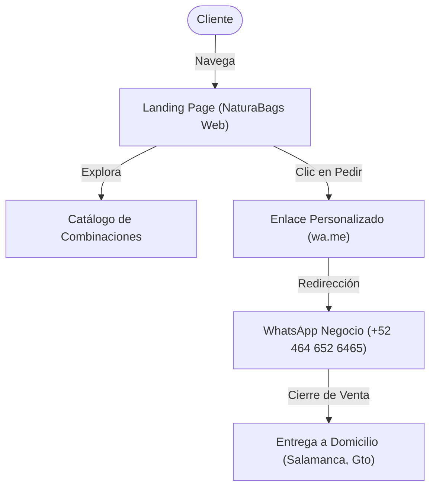

# 🥦 NaturaBags - Web Client

> Bolsas de frutas y verduras frescas, picadas y desinfectadas listas para licuar. ¡Tu dosis diaria de salud en Salamanca, Gto!

Este repositorio contiene el código fuente de la Landing Page del cliente web de **NaturaBags**, desarrollada con un enfoque de alto rendimiento, diseño premium, completamente responsiva y optimizada para la conversión directa de ventas a través de WhatsApp.

---

## 📈 El Negocio

**NaturaBags** es una solución de bienestar físico y conveniencia. Su objetivo principal es facilitar a profesionales ocupados y familias preocupadas por su salud la preparación de jugos naturales en menos de un minuto. 

### Propuesta de Valor
* **Fresh & Clean:** Ingredientes frescos, previamente seleccionados, picados, desinfectados y porcionados.
* **Sin Aditivos:** 100% natural, sin conservadores ni azúcares añadidos.
* **Nutrición Preservada:** Congelados al momento exacto para retener todas sus vitaminas y minerales.
* **Simplificado:** El cliente no pierde tiempo pelando, picando o limpiando; solo añade su líquido preferido y licúa.

### Flujo del Cliente


---

## 🛠️ Stack Tecnológico

El proyecto se diseñó utilizando tecnologías de vanguardia en el desarrollo web front-end para garantizar un LCP óptimo y SEO sobresaliente:

* **Framework Principal:** [Nuxt 4](https://nuxt.com/) (Ejecutándose en modo SSG - Static Site Generation).
* **Lenguaje:** TypeScript para mayor robustez y tipado estructurado.
* **Estilos:** Vanilla CSS moderno con Custom Properties (CSS variables) definidas en un sistema de diseño centralizado (`Organic Vitality`).
* **Iconografía:** [Nuxt Icon](https://github.com/nuxt/modules/tree/main/packages/icon) cargando iconos vectoriales ligeros de `lucide` y `mdi`.
* **Tipografía:** [Nuxt Fonts](https://github.com/nuxt/modules/tree/main/packages/fonts) que sirve de forma local y optimizada las fuentes de Google Fonts: **Quicksand** (títulos orgánicos) y **Work Sans** (legibilidad corporal).
* **Gestión de Paquetes:** `pnpm` para descargas ultrarrápidas y gestión eficiente de espacio en disco.

---

## 📁 Arquitectura y Estructura del Proyecto

El proyecto sigue la convención moderna de directorios estructurados en la raíz `/app` que promueve Nuxt 4:

```
naturabags-web/
├── app/
│   ├── app.vue                  # Componente principal de renderizado
│   ├── assets/
│   │   └── css/
│   │       ├── tokens.css       # Design System (Colores, Espaciado, Tipografía)
│   │       ├── base.css         # Resets CSS y clases globales
│   │       └── components/      # Hojas de estilo modulares por componente
│   ├── components/
│   │   ├── AppHeader.vue        # Barra de navegación superior
│   │   ├── AppFooter.vue        # Pie de página con información del negocio
│   │   ├── SectionHero.vue      # Sección de impacto principal
│   │   ├── SectionInstructions.vue # Sección interactiva paso a paso
│   │   └── WhatsappFab.vue      # Botón flotante de WhatsApp de alta conversión
│   ├── composables/
│   │   └── useWhatsapp.ts       # Generación dinámica de enlaces y textos para WhatsApp
│   ├── layouts/
│   │   └── default.vue          # Estructura del diseño global
│   └── pages/
│       └── index.vue            # Página principal y punto de entrada
├── public/
│   ├── logonb.png               # Logotipo oficial de NaturaBags
│   └── robots.txt               # Configuración para rastreadores de motores de búsqueda
├── nuxt.config.ts               # Archivo de configuración central de Nuxt 4
├── Dockerfile                   # Configuración del contenedor Docker (Build de producción + Nginx)
├── nginx.conf                   # Configuración del servidor web Nginx
└── package.json                 # Dependencias y scripts de ejecución
```

---

## ⚙️ Guía de Instalación y Desarrollo Local

Sigue las siguientes instrucciones para clonar y ejecutar el proyecto en tu máquina local.

### Prerrequisitos
* Node.js v20 o superior.
* `pnpm` instalado de manera global (`npm i -g pnpm`).

### 1. Instalar dependencias
```bash
pnpm install
```

### 2. Iniciar el servidor de desarrollo
El servidor local se levantará en `http://localhost:3000`:
```bash
pnpm dev
```

### 3. Generar la versión estática (SSG)
Compila la web completa en archivos estáticos listos para producción (generados dentro de `.output/public`):
```bash
pnpm generate
```

### 4. Vista previa local del build estático
```bash
pnpm preview
```

---

## 🐳 Despliegue en Producción (Docker)

El proyecto cuenta con soporte de contenedorización multi-etapa para generar compilaciones ligeras y servir la aplicación estática a través de un servidor Nginx optimizado para producción.

### Construir la imagen Docker
```bash
docker build -t naturabags-web:latest .
```

### Levantar el contenedor localmente
El proyecto estará expuesto a través del puerto `8080`:
```bash
docker run -d -p 8080:80 --name naturabags-site naturabags-web:latest
```

---

## 🎨 Sistema de Diseño (Organic Vitality)

La interfaz se rige por un esquema de color que inspira frescura y limpieza:
* **Verde Primario (`#8CD416`):** Representa frescura, energía e ingredientes naturales.
* **Verde Secundario (`#4DA82E`):** Aporta estabilidad, contraste y soporte visual.
* **Superficies Claras (`#fcf9f8`):** Evita la fatiga visual y proyecta un ambiente pulcro y moderno.
* **Tipografía Quicksand:** Curvas suaves y amigables que sintonizan con formas orgánicas.
